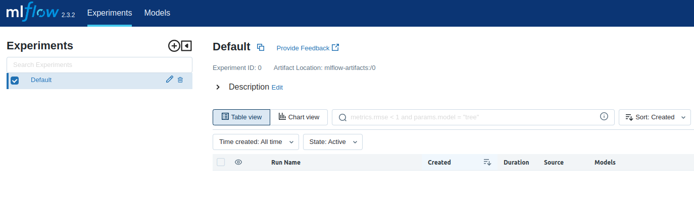
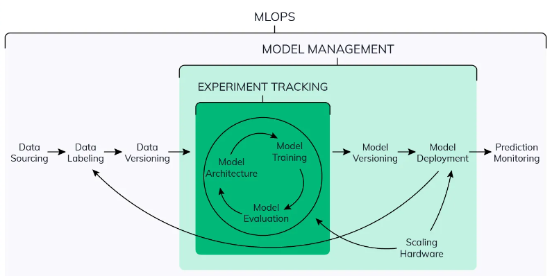

# Module 2 - Experiment tracking and model management

## Table of contents

1. [Experiment tracking intro](#1-experiment-tracking-intro).
2. [Getting started with MLflow](#2-getting-started-with-mlflow).
3. [Experiment tracking with MLflow](#3-experiment-tracking-with-mlflow).
4. [Model management](#4-model-management).
5. [Model registry](#5-model-registry).
6. []().
7. []().


> **Sources:**
> * DataTalksClub [videos](https://www.youtube.com/watch?v=MiA7LQin9c8&list=PL3MmuxUbc_hIUISrluw_A7wDSmfOhErJK).
> * DataTalksClub [slides](./experiment_tracking_mlops_zoomcamp.pdf)
> * Álvaro Navas [notes](https://github.com/ziritrion/mlopszoomcamp/blob/main/notes/2_experiment.md).


## 1. Experiment tracking intro

[Video source](https://www.youtube.com/watch?v=MiA7LQin9c8).


**Important concepts:**
* **ML experiment:** the process of building an ML model.
* **Experiment run:** each trial in an ML experiment.
* **Run artifact:** any file that is associated with an ML run.
* **Experiment metadata:** all the information about an ML experiment, such as the source code used, the name of the user, etc.


**What is experiment tracking?**  
Experiment tracking is the process of keeping track of all the relevant information from an ML experiment, which includes:
* Source code.
* Environment.
* Data.
* Model.
* Hyperparameters.
* Metrics.
* ...

What we understand by _relevant information_ may vary depending on the nature and needs of the specific experiment.  


**Why is experiment tracking so important?**  
In general, because of these 3 main reasons:
* Reproducibility: data scientists, as any other scientists, need to work with experiments that are reproducible.
* Organization: either working within a team or alone, we want to easily find what we need, be able to go back to a previous work, etc.
* Optimization: experiment tracking tools allow us to create efficient workflows and automate certain steps which are usually performed manually.


**Tracking experiments in spreadsheets**  
One of the most basic experiment tracking system we can think of is using a spreadsheet to keep track of our results. Why this is not enough?
* It's error prone.
* There is no standard format.
* Not the best tool in terms of visibility and collaboration.


### MLflow

Definition from [the official website](https://mlflow.org/): _an open source platform for the machine learning lifecycle._  

In practice, it's just a Python package that can be installed with _pip_, and it contains four main modules:
* [Tracking](https://mlflow.org/docs/latest/tracking.html).
* [Models](https://mlflow.org/docs/latest/models.html).
* [Model registry](https://mlflow.org/docs/latest/model-registry.html).
* [Projects](https://mlflow.org/docs/latest/projects.html).


**Tracking experiments with MLflow**

The MLflow Tracking module allows you to organize your experiments into runs, and keep track of:
* Parameters.
* Metrics.
* Metadata.
* Artifacts.
* Models.

Along with this information, MLflow automatically logs extra information about the run:
* Source code.
* Version of the code (git commit).
* Start and end time.
* Author.


## 2. Getting started with MLflow

[Video source](https://www.youtube.com/watch?v=cESCQE9J3ZE).


### Installing and running MLflow

MLflow is included in the [requirements.txt](../requirements.txt) file, as well as the other packages needed to complete the course.

Once it's installed, we can run `mlflow --help` from our terminal to see the options available in the MLflow CLI.

We can access the MLflow web UI by running `mlflow ui`. However, we need to provide a backend storage in order to save and retrieve our experiment data. We can use SQLite as a backend with the following command:

```bash
mlflow ui --backend-store-uri sqlite:///mlflow.db
```

This creates a `mlflow.db` file in our current working directory. We should now be able to access the UI via `http://127.0.0.1:5000`.




### Using MLflow with Jupyter Notebook

For this section, we are going to use a copy of `trip_duration_prediction.ipynb` notebook from module 1 and modify it acordingly to track our experiments with MLflow. The updated notebook is renamed as [`trip_duration_prediction_mlflow.ipynb`](./trip_duration_prediction_mlflow.ipynb).

The first steps are importing the MLflow library and setting two necessary tracking parameters:

```python
import mlflow

mlflow.set_tracking_uri("sqlite:///mlflow.db")
mlflow.set_experiment("nyc_taxi_experiment")
```

* `set_tracking_uri` points to our backend storage, so the uri used here must match the uri provided when we previously run MLflow from the console.
* `set_experiment` is used to define the name of our experiment.

If it doesn't exist, MLflow will create a new experiment when we run the cell.

A simple way to track the experiment runs that we execute in our notebook is by wrapping our code inside a `with` statement.

```python
with mlflow.start_run():
    
    mlflow.set_tag("developer", "sergiogrz")
    
    mlflow.log_param("train_data_file", "green_tripdata_2021-01.parquet")
    mlflow.log_param("valid_data_file", "green_tripdata_2021-02.parquet")
    
    alpha = 0.01
    mlflow.log_param("alpha", alpha)
    
    lr = Lasso(alpha)
    lr.fit(X_train, y_train)
    
    y_pred = lr.predict(X_val)
    
    rmse = mean_squared_error(y_val, y_pred, squared=False)
    mlflow.log_metric("rmse", rmse)
```

* `mlflow.start_run()` returns the current active run, if one exists.
* `mlflow.set_tag()` creates a key-value tag in the current active run.
* `mlflow.log_param()` logs a single key-value parameter in the current active run.
* `mlflow.log_metrics()` logs a single key-value metric, which must always be a number.

When we execute an experiment run, all its information registered can be found in the MLflow UI.


## 3. Experiment tracking with MLflow

[Video source](https://www.youtube.com/watch?v=iaJz-T7VWec).

We continue working on the [`trip_duration_prediction_mlflow.ipynb`](./trip_duration_prediction_mlflow.ipynb) notebook. Here, we are going to introduce hyperparameter tuning, in order to be able to compare many experiment runs easily. To this end, we make use of [**hyperopt**](https://hyperopt.github.io/hyperopt/), which is a library for distributed hyperparameter optimization.

In this section, we are going to experiment with [XGBoost](https://xgboost.readthedocs.io/en/stable/index.html) algorithm.

The way to use hyperopt ([source](https://github.com/hyperopt/hyperopt/wiki/FMin)) is to describe:
* the objective function to minimize.
* the space over which to search.
* the database in which to store all the point evaluations of the search.
* the search algorithm to use.

For our example we use the following imports:

```python
from hyperopt import fmin, tpe, hp, STATUS_OK, Trials
from hyperopt.pyll import scope
```
* `fmin` is a method to minimize the objective function.
* `tpe` is the algorithm that we will provide for minimizing.
* `hp` contains different methods to define the search space for hyperparameter tuning.
* `STATUS_OK` is a signal for letting hyperopt know that the objective function has run successfully.
* The `Trials` object keeps track of information from each run.
* `scope` is for defining ranges.


### Defining the objective function

Next, we need to define the objective function. In our case, we want to minimize the RMSE, so that's what our function will return.


```python
import xgboost as xgb

#assuming we already have the dataframes in memory, we create the matrices for xgboost
train = xgb.DMatrix(X_train, label=y_train)
valid = xgb.DMatrix(X_val, label=y_val)

#params contains the hyperparameters for xgboost for a specific run
def objective(params):

    with mlflow.start_run():

        #set a tag for easier classification and log the hyperparameters
        mlflow.set_tag("model", "xgboost")
        mlflow.log_params(params)

        #model definition and training
        booster = xgb.train(
            params=params,
            dtrain=train,
            num_boost_round=1000,
            evals=[(valid, 'validation')],
            early_stopping_rounds=50
        )

        #predicting with the validation set
        y_pred = booster.predict(valid)

        #rmse metric and logging
        rmse = mean_squared_error(y_val, y_pred, squared=False)
        mlflow.log_metric("rmse", rmse)

    #we return a dict with the metric and the OK signal
    return {'loss': rmse, 'status': STATUS_OK}
```


### Defining the search space

The _search space_ refers to the ranges where we want hyperopt to explore the hyperparameters. The [official documentation](https://hyperopt.github.io/hyperopt/getting-started/search_spaces/) explains in detail this concept and the different parameters we can use.

```python
search_space = {
    'max_depth': scope.int(hp.quniform('max_depth', 4, 100, 1)),
    'learning_rate': hp.loguniform('learning_rate', -3, 0),  # [exp(-3), exp(0)] = [0.05, 1]
    'reg_alpha': hp.loguniform('reg_alpha', -5, -1),
    'reg_lambda': hp.loguniform('reg_lambda', -6, -1),
    'min_child_weight': hp.loguniform('min_child_weight', -1, 3),
    'objective': 'reg:linear',
    'seed': 42
}
```

* We define a dict with all the hyperparameters we want to explore and finetune.
* We use _stochastic expressions_ to define our parameter search. All expressions require a _label_ parameter (the first param in all functions above).
* `hp.quniform()` returns a "quantized" value uniformly between `a` and `b`. In other words: it returns **discreet** values in intervals of `q` following a uniform distribution between `a` and `b`.
  * In this example, we're searching for values between 4 and 100 for our `max_depth` hyperparam.
* `scope.int()` is for defining a range of integers. `hp.quniform()` returns floats, so we need `scope.int()` if we want to use integers.
* `hp.loguniform()` returns the exponential of a number between `a` and `b` following a uniform distribution.
  * `hp.loguniform('learning_rate', -3, 0)` returns a value between `0.05` and `1` which grows exponentially, similar to how we usually test learning rates in decimal increments such as `0.001`, then `0.01` and `0.1`.


### Minimizing the objective function

Once we have defined the objective function and the search space, we need to minimize the objective function. We do this by calling the `fmin` method and passing all of the necessary info:

```python
best_result = fmin(
    fn=objective,
    space=search_space,
    algo=tpe.suggest,
    max_evals=50,
    trials=Trials()
)
```

* `fn` receives our objective function.
* `space` receives our search space.
* `algo` defines the _search algorithm_ that we wil use.
  * `tpe` stands for [Tree of Parzen Estimators](https://papers.nips.cc/paper/4443-algorithms-for-hyper-parameter-optimization.pdf), an algorithm for hyperparameter optimization.
  * `tpe.suggest` is the default choice for almost all projects. For dummy projects, you could use `hyperopt.random.suggest` instead.
* `max_evals` defines the maximum amount of evaluation iterations for hyperparameter search.
* `trials` receives and object which will store all of the experiment info.
  * `Trials()` is a method that returns such an object for us.
  * The object receives all of the dictionaries returned by the objective function and stores them.


### Running the experiment and comparing results

Executing the last code block will start the experiment. Hyperopt will perform multiple runs trying to seach for the best hyperparameters. Each of these runs can be found in the MLflow UI.

By filtering for `tags.model = "xgboost"` we can select all these runs and compare them in a graph to see how the different hyperparameters affect the RMSE:
* The _Parallel Coordinates Plot_ may be very useful to quickly see any possible correlations between hyperparameter values and RMSE.
* The _Scatter Plot_ allows us to compare 2 specific variables, such as a hyperparm and the RMSE. It can also be helpful to uncover patterns.
* The _Contour Plot_ is similar to _Scatter Plot_ but it adds an additional variable to the comparison in the form of a contour map.

We can also sort the search results to see which model has the lowest RMSE. Keep in mind that we might not always want the lowest error: for complex models, the model with the lowest error might be too heavy and complex for our needs, so we must choose according to our needs and the hyperparam results.


### Retraining with the optimal hyperparameters and automatic logging

We now know the best hyperparams for our model but we have not saved the weights; we've only tracked the hyperparam values. So now we can retrain the model with the hyperparameters we have chosen and save the model with MLflow. This can be simply done by defining the params and the training code wrapped with the `with mlflow.start_run()` statement, defining a tag and tracking all metrics and parameters that we need.

However, there is a better way. MLflow has support for [***automatic logging***](https://www.mlflow.org/docs/latest/tracking.html#automatic-logging) for certain ML frameworks. Automatic logging allows us to track a lot of information that we may need without having to manually specify all the data and artifacts to track. Here's an example:

```python
params = {
    "learning_rate": 0.1126860623846719,
    "max_depth": 11,
    "min_child_weight": 7.128461099684721,
    "objective": "reg:linear",
    "reg_alpha": 0.04429046957254972,
    "reg_lambda": 0.09902356874800584,
    "seed": 42,
}

mlflow.xgboost.autolog()

booster = xgb.train(
  params=best_params,
  dtrain=train,
  num_boost_round=1000,
  evals=[(valid, 'validation')],
  early_stopping_rounds=50
)
```

Running this code will create a new run and track all relevant hyperparams, metrics and artifacts for XGBoost.

Keep in mind that training time will likely be slightly longer than the run with the same hyperparams when searching with Hyperopt due to MLflow logging lots of data.

In the MLflow web UI we can see all of the logged data, including a `requirements.txt` file for replicating the environment used for the experiment and code snippets to load the stored model and run predictions.


## 4. Model management

[Video source](https://www.youtube.com/watch?v=OVUPIX88q88).


As we can see in the image below ([source](https://neptune.ai/blog/ml-experiment-tracking)), **model management** is a subset of MLOps which encompasses experiment tracking, model versioning and deployment, as well as hardware scaling. 




Once we have a model defined from experiment tracking stage, we start thinking about saving this model in some place, as well as some kind of versioning that we may like to do before deploying it into production. In this section we see how to manage and deploy our models using MLflow.


We can think of folder systems as a very basic way of managing our model versions. However, this solution shows several problems, similarly to spreadsheets for experiment tracking:
* Error prone: manual task.
* No versioning.
* No model lineage: it's not easy to understand how all of our models were created, what hyperparameters were used, etc.

In order to solve these issues, we can use MLflow for managing our models.


### Model management with MLflow

As in the previous sections, we make use of the [`trip_duration_prediction_mlflow.ipynb`](./trip_duration_prediction_mlflow.ipynb) notebook.

Here we see two ways to log models in MLflow:
* As an artifact.
* Using `log_model` method.


**Log model as an artifact**  

Tracking an artifact is just like tracking any other element in MLflow, such as parameters or metrics. The simplest way of model management is simply to track the model as an artifact. Below we add a line for tracking our model at the end of the scikit-learn code we have previously seen.

```python
with mlflow.start_run():
    
    mlflow.set_tag("developer", "sergiogrz")
    
    mlflow.log_param("train_data_file", "green_tripdata_2021-01.parquet")
    mlflow.log_param("valid_data_file", "green_tripdata_2021-02.parquet")
    
    alpha = 0.6
    mlflow.log_param("alpha", alpha)
    
    lr = Lasso(alpha)
    lr.fit(X_train, y_train)
    
    y_pred = lr.predict(X_val)
    
    rmse = mean_squared_error(y_val, y_pred, squared=False)
    mlflow.log_metric("rmse", rmse)
    
    # track model
    mlflow.log_artifact(local_path="./models/lin_reg.bin", artifact_path="models_pickle")
```

`mlflow.log_artifact()` logs a local file or directory as an artifact.
  * `local_path`: path to the file to write.
  * `artifact_path`:  directory in `artifact_uri` to write to.
  * The model (in this example `models/lin_reg.bin`) must exist locally beforehand in order to be able to log it as an artifact. As we have previously seen, we can save a model as follows:

      ```python
      with open("./models/lin_reg.bin", "wb") as f_out:
          pickle.dump((dv, lr), f_out)
      ```


The model created as an artifact can then be found and downloaded from the MLflow UI.


**Log model using `log_model` method**  

The limitation with artifact tracking for model management is that it's cumbersome to search for a specific model, download the bin file and create the code to load it and run predictions.

A better way for logging models is by using `log_model` method.

```python
# for this example, we turn off autologging
mlflow.xgboost.autolog(disable=True)

with mlflow.start_run():
    
    train = xgb.DMatrix(X_train, label=y_train)
    valid = xgb.DMatrix(X_val, label=y_val)

    best_params = {
        "learning_rate": 0.1126860623846719,
        "max_depth": 11,
        "min_child_weight": 7.128461099684721,
        "objective": "reg:linear",
        "reg_alpha": 0.04429046957254972,
        "reg_lambda": 0.09902356874800584,
        "seed": 42,
    }
    
    mlflow.log_params(best_params)

    booster = xgb.train(
        params=best_params,
        dtrain=train,
        num_boost_round=1000,
        evals=[(valid, 'validation')],
        early_stopping_rounds=50
    )

    y_pred = booster.predict(valid)

    rmse = mean_squared_error(y_val, y_pred, squared=False)
    mlflow.log_metric("rmse", rmse)
    
    # log preprocessor
    with open("./models/preprocessor.b", "wb") as f_out:
        pickle.dump(dv, f_out)
    mlflow.log_artifact(local_path="./models/preprocessor.b", artifact_path="preprocessor")
    
    # log model
    mlflow.xgboost.log_model(booster, artifact_path="models_mlflow")
```

MLflow offers model logging for specific frameworks. `mlflow.xgboost.log_model()` takes our model object and stores it in the provided artifact path.


It's also relevant to log the DictVectorizer we used to preprocess our dataset, since we will need it for future predictions.


### Making predictions

We can make use of the code snippets provided within the artifact we just created for loading the model and making predictions.

MLflow stores the model in a format that allows us to load it in different "flavors". For example, our XGBoost model can be loaded as a PyFuncModel or as an XGBoost model.

```python
logged_model = 'runs:/.../models_mlflow'

#Load model as a PyFuncModel
loaded_model = mlflow.pyfunc.load_model(model_uri=logged_model)

#Load model as a XGBoost model
xgboost_model = mlflow.xgboost.load_model(model_uri=logged_model)
```

The loaded models are regular objects of their respective framework "flavor". We can then make use of any of their methods.

```python
y_pred = xgboost_model.predict(valid)
```


## 5. Model registry

[Video source](https://www.youtube.com/watch?v=TKHU7HAvGH8).

